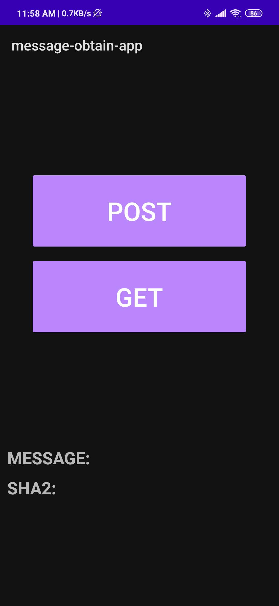
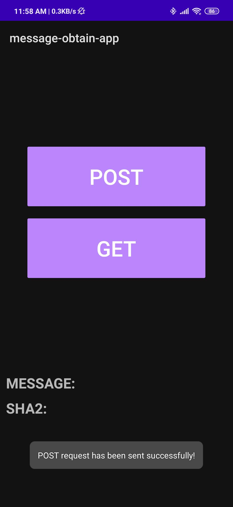
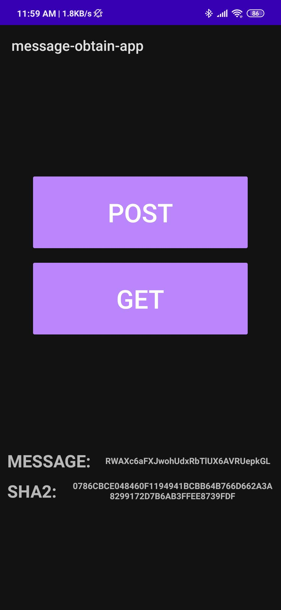

# message-obtain-app

## Description
There is a backend service that generates a random 32-chars length message and its sha256 hashcode and put them to DB:

https://github.com/Iskanred/message-generating-backend

So, this android application is the client-side that sends requests to the server for generating such a data and requests for obtaining the generated data.

## How to use
POST-button click leads to sending POST-request for generating a message and its sha256 on the server-side.

GET-button click leads to sending GET-request for getting a message and its sha256 from the server-side.

### Examples
* At start
  
  
* After clicking on POST-button
  
  
* After clicling on POST-button and then on GET-button
   
